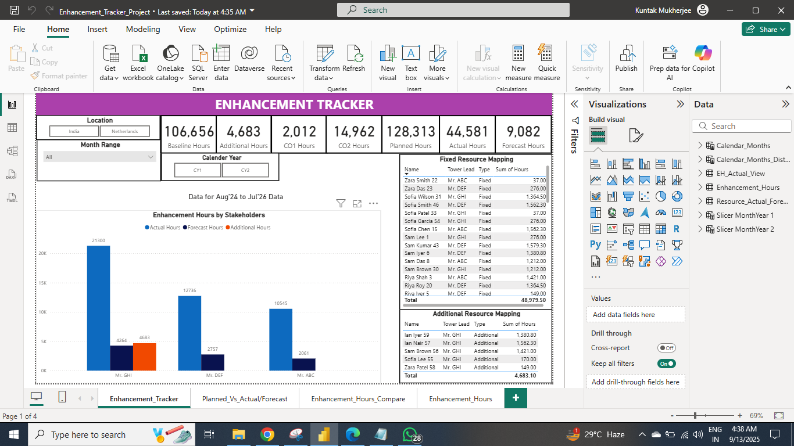
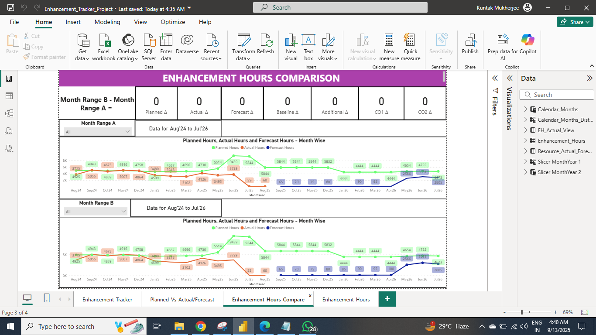
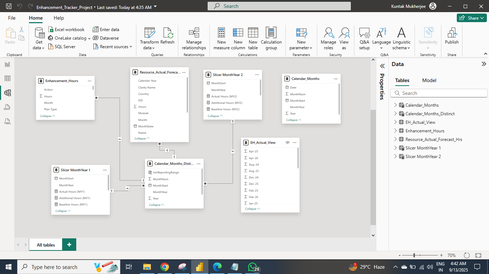

# 📊 Enhancement Tracker Power BI Dashboard

This project demonstrates a **Power BI dashboard** built with dummy data to track **enhancement hours** (Baseline, Planned, Actual, Forecast, CO1, CO2, Additional).  
It is designed to showcase my **data modeling, DAX, and visualization skills**.

---

## ✨ Key Features
- **4-page interactive Power BI report**
- **Data Model** with multiple fact/dimension tables
- **DAX Measures** for variance, variance %, forecast accuracy, and deltas
- **Visualizations**: KPI cards, line & combo charts, bar charts, matrices, slicers
- Built from **Excel dummy data** (provided in repo)

---

## 📂 Project Structure
data/ → Source Excel file (dummy data)
report/ → Power BI report
├─ Enhancement_Tracker_Sample.pbix
└─ screenshots/ → PNG images of report pages

---

## 📸 Screenshots

### 1. Enhancement Tracker (Overview)

### 2. Planned vs Actual/Forecast

### 3. Enhancement Hours Comparison

### 4. Enhancement Hours (Year-Wise)

### 5. Data Model

---

## 📊 How to Explore
1. Clone this repo or download it as a ZIP:  
   - Repo: https://github.com/kuntaak/enhancement-tracker-powerbi  
   - Download ZIP: https://github.com/kuntaak/enhancement-tracker-powerbi/archive/refs/heads/main.zip  
2. Or download files directly:  
   - [PBIX report](enhancement-tracker-powerbi/report/Enhancement_Tracker_Project.pbix)  
   - [Excel data](enhancement-tracker-powerbi/data/E_Hours_Practice.xlsx)  
3. Open the PBIX in **Power BI Desktop (Sept 2025 or later)**.  
4. Refresh data if needed.  

---

## 🚀 Skills Demonstrated
- **Data Modeling**: Star Schema with Calendar & Slicer tables  
- **Power Query**: Transformations, unpivoting, data cleaning  
- **DAX Calculations**: Variance, Variance %, Forecast Accuracy, Delta values  
- **Dashboard Design**: User-friendly layout with KPIs, trend lines, comparison views  

---

## 📝 Resume Highlights
- Designed and built a **multi-page Power BI dashboard** to analyze enhancement hours  
- Modeled data from Excel into a clean star schema using Power Query and DAX  
- Built custom measures for comparing Planned vs Actual vs Forecast across multiple years  
- Created a professional GitHub showcase with PBIX, source data, screenshots, and documentation  

---

## 📬 Contact
If you’d like to know more about this project or discuss opportunities:  
- [LinkedIn](https://www.linkedin.com/in/kuntak-mukherjee/)  
- [Email](mailto:kuntak9m@gmail.com)
